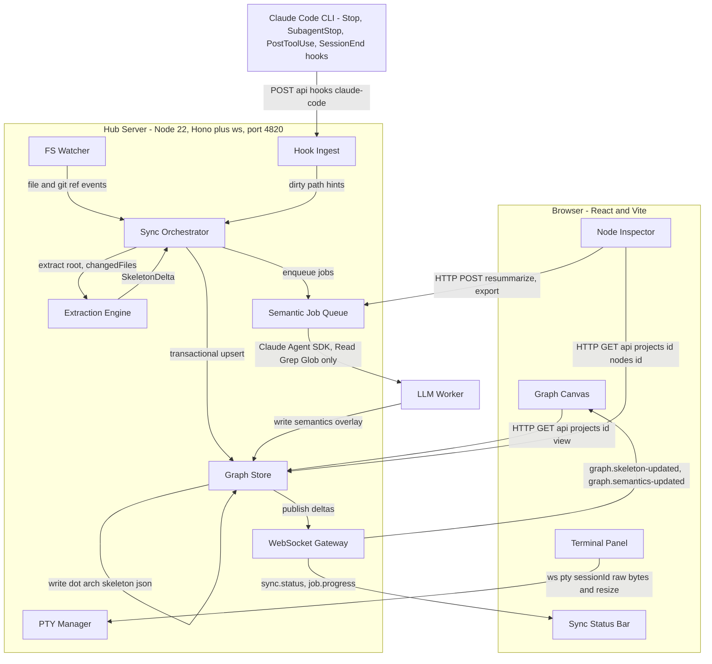
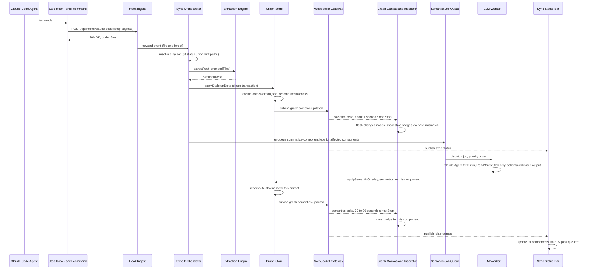

# Hub Architecture

This document is the system-architecture specification for the Hub. It is normative: implementers build exactly what is described here. Where this document is silent, consult `DATA_MODEL.md` (graph data model), `SYNC_PIPELINE.md` (sync loop mechanics), and `STACK.md` (technology decisions and rationale).

## 1. Process model

The Hub is exactly two processes at runtime:

1. **Hub Server** — a single long-running Node 22 process on the developer's machine. It owns *all* state: the SQLite cache, the in-memory dirty sets and debounce timers, the PTY sessions, the semantic job queue, and the only writer access to each tracked repo's `.arch/` directory. It listens on **port 4820** for both HTTP and WebSocket traffic.
2. **Browser tab** — a React/Vite single-page app loaded from the Hub Server. It holds no durable state of its own beyond what Zustand mirrors from server-pushed WebSocket deltas. It is view plus terminal keyboard: every action a user takes (drill into a node, resize a pane, type into the terminal) either renders already-known state or issues an HTTP/WS request back to the server.

There is no database, queue, or process outside these two. Multiple browser tabs may connect to the same server (e.g. a second monitor), but the server remains the single source of truth; tabs never coordinate with each other directly.

Corollary: if the Hub Server process is not running, the browser tab is inert (it will show a connection-lost state) but **Claude Code itself is never blocked** — this is enforced at the hook level (see `SYNC_PIPELINE.md` §Hook installation).

## 2. Component diagram



## 3. Server components

### 3.1 PTY Manager

- **Responsibilities.** Spawns one `node-pty` process per terminal tab (default shell or `claude`), keyed by `sessionId`. Bridges each session over `/ws/pty/:sessionId` as raw bytes in both directions plus a small control-message channel for resize (`{ type: "resize", cols, rows }`). Maintains a ~200KB scrollback ring buffer per session so a browser refresh or reconnect can reattach and replay recent output instead of losing the session.
- **Interface.** `createSession(cwd, command?) -> sessionId`; `attach(sessionId, ws)`; `write(sessionId, data: Buffer)`; `resize(sessionId, cols, rows)`; `list() -> SessionSummary[]`; `kill(sessionId)`.
- **Must NOT.** Parse, scrape, or interpret PTY output for any purpose. The terminal is a dumb pipe. The PTY Manager must never call into the Sync Orchestrator, Extraction Engine, or Graph Store, and the sync loop must never depend on PTY output. This independence is load-bearing: sync is driven exclusively by hooks and the filesystem/git watcher, never by "reading what the agent printed." A `claude` session running in a PTY tab is exposed to the Hook Health check (§3.2) only as "a session with this `cwd` is active," never by content.

### 3.2 Hook Ingest

- **Responsibilities.** Exposes `POST /api/hooks/claude-code`. Receives Claude Code hook JSON on stdin-piped request body (event name, `cwd`, `session_id`, `transcript_path`, and for `PostToolUse` the tool name/input). Resolves `cwd` (realpath-normalized) to a tracked project. Forwards a minimal event record to the Sync Orchestrator and returns immediately.
- **Interface.** `POST /api/hooks/claude-code` — see `SYNC_PIPELINE.md` §Hook payload handling for the exact contract and latency mechanics.
- **Must NOT.** Perform any synchronous work before responding: no git calls, no SQLite writes, no extraction, no awaiting the Sync Orchestrator. The handler enqueues onto an in-process event emitter and returns `200 OK` in under 5ms unconditionally — including when `cwd` doesn't map to a tracked project (silently ack and drop) or the body fails to parse (ack and drop; log to the `events` table on a best-effort basis). A slow or blocked Hub must never translate into a slow or blocked Claude Code turn.

### 3.3 FS Watcher

- **Responsibilities.** Runs a chokidar watcher per tracked repo as the fallback/backstop sync trigger for edits that don't arrive via hooks (manual edits, non-Claude-Code tools, hook misconfiguration). Also runs a narrow second watch on `.git/HEAD` and `.git/refs/**` (which the main watcher explicitly ignores) to detect commits and branch switches. See `SYNC_PIPELINE.md` §Hook health and fallback watcher for exact chokidar configuration.
- **Interface.** `watch(projectId, root)`; `unwatch(projectId)`; emits `change(projectId, path)`, `gitRefChange(projectId)` to the Sync Orchestrator.
- **Must NOT.** Treat itself as the primary trigger — hooks are the primary, low-latency path; the watcher exists so sync correctness never depends on hooks firing. Must not watch inside `.git/` (other than `HEAD`/`refs/**`), `node_modules/`, `.arch/`, or gitignored paths — watching these would produce debounce storms during installs or extraction writes.

### 3.4 Sync Orchestrator

- **Responsibilities.** Owns the per-project dirty set, the 1500ms debounce timer, the per-project state machine (`idle → dirty → extracting → semantic-pending → idle`, see `SYNC_PIPELINE.md`), invocation of the Extraction Engine, handing the resulting `SkeletonDelta` to the Graph Store for diff/persist/publish, mapping changed files to affected components, enqueueing semantic jobs, and triggering the WebSocket Gateway publish calls that follow each state transition.
- **Interface.** `onHookEvent(projectId, event)`; `onWatcherEvent(projectId, path)`; `onGitRefChange(projectId)`; internally: `resolveDirtySet(projectId) -> string[]`; `runExtractionCycle(projectId)`.
- **Must NOT.** Run two extraction cycles concurrently for the same project. Enforced by an async mutex: exactly one extraction run in flight per project, ever. Events arriving while a cycle is `extracting` or `semantic-pending` do not start a second cycle — they accumulate into the dirty set and the state machine transitions back to `dirty`, guaranteeing the *next* cycle picks them up. The orchestrator must not write `.arch/` files directly — persistence is exclusively the Graph Store's job — and must not call the LLM directly — job dispatch is exclusively the Semantic Job Queue's job.

### 3.5 Extraction Engine

- **Responsibilities.** Deterministic static analysis. Exposes a pluggable analyzer interface so language support can grow without touching the orchestrator:

  ```ts
  interface Analyzer {
    id: string;
    version: string;
    detect(root: string): boolean;
    extract(root: string, changedFiles?: string[]): SkeletonDelta;
  }
  ```

  MVP ships exactly one analyzer, `ts-js`, built on dependency-cruiser (import graph) and web-tree-sitter (per-file facts: exports, route registrations, test detection). See `STACK.md` for why. `changedFiles` omitted (or absent from the call) means a full run; present means incremental — see `SYNC_PIPELINE.md` §Incremental extraction for the exact algorithm.
- **Interface.** `extract(root, changedFiles?) -> SkeletonDelta` where `SkeletonDelta` is `{ upsertedFiles, removedFiles, upsertedNodes, removedNodeIds, upsertedEdges, removedEdges }` (see `DATA_MODEL.md` for the full skeleton node/edge shapes these reference).
- **Must NOT.** Call any LLM, read or write anything under `semantics/`, consult `.arch/semantics/*.json`, or depend on the current SQLite contents. Purity is the contract: the same file tree in (same content, same set of files) must always produce the same skeleton out — same node IDs, same edge set, same serialized bytes. This is what makes skeleton diffs, golden-snapshot tests, and cross-commit comparison meaningful.

### 3.6 Graph Store

- **Responsibilities.** Owns `.arch/` (source of truth, git-committed) and the SQLite cache (derived, disposable, rebuilt by `hub reindex`). Applies `SkeletonDelta`s from the Extraction Engine and overlay writes from Semantic Job Queue workers, in each case as a single transaction that updates SQLite, rewrites the relevant `.arch/` file(s) with deterministic serialization, and recomputes staleness for every semantic artifact whose footprint touched a changed file. Serves the read API the frontend depends on.
- **Interface.**
  - `applySkeletonDelta(projectId, delta) -> { nodeChanges, edgeChanges }` — used by the Sync Orchestrator.
  - `applySemanticOverlay(projectId, componentId, overlay)` — used by Semantic Job Queue workers.
  - `getView(projectId, focusNodeId?) -> { nodes, edges, staleness }` — children of `focusNodeId` (root/system if omitted) plus lifted edges among them plus per-node staleness badges. See `DATA_MODEL.md` §Edge lifting and §Staleness for the exact algorithms.
  - `getNode(projectId, nodeId) -> NodeDetail` — full inspector payload: skeleton facts, semantic summary if present, inbound/outbound edges, provenance.
  - `reindex(projectId?)` — drops and rebuilds the SQLite cache from `.arch/` (and re-walks the repo if `.arch/` itself is missing/corrupt) for one project or all tracked projects.
- **Must NOT.** Ever let a semantic write touch `skeleton.json`/`manifest.json`, or a skeleton write touch `semantics/**`. This is the two-layer principle (`DATA_MODEL.md` §1) enforced at the component boundary, not just by convention: the Graph Store's skeleton-write code path and semantics-write code path share no mutation logic and can be reasoned about (and tested) independently.

### 3.7 Semantic Job Queue

- **Responsibilities.** SQLite-backed job table (`jobs`, see `DATA_MODEL.md`) so queued/in-flight state survives a Hub restart. Concurrency 1–2 workers, priority-ordered dispatch. Each worker invokes the Claude Agent SDK (`@anthropic-ai/claude-agent-sdk`) headless, constrained to `Read`/`Grep`/`Glob` tools, sandboxed to the target repo, with a capped `maxTurns` and JSON-schema-validated output; falls back to a `claude -p --output-format json` subprocess under the same job contract when the SDK path is unavailable. Job types: `cluster`, `summarize-component`, `diagram`, `describe-tests`. Full scheduling, dedup, retry, and clustering-safety rules are specified in `SYNC_PIPELINE.md` §Semantic scheduling.
- **Interface.** `enqueue(projectId, type, targetId?, priority) -> jobId` (deduplicating by `(type, targetId)`); `drain()` (worker loop); emits `job.progress` events to the WebSocket Gateway.
- **Must NOT.** Block skeleton updates on its own progress. The skeleton layer is complete and correct within ~1s of a hook firing regardless of queue depth, model availability, or job failures — see §5. Workers must not be granted `Write`/`Edit`/`Bash` tools; they read the repo and produce structured JSON, never mutate source.

### 3.8 WebSocket Gateway

- **Responsibilities.** Topic pub/sub on `/ws/events`. Publishes deltas (never whole-graph payloads) so the browser stays in sync with O(change) traffic. Also serves raw PTY byte streams on `/ws/pty/:sessionId`, which is a distinct, non-topic-based path owned in practice by the PTY Manager but multiplexed through the same underlying `ws` server instance.
- **Interface.** See §6 WebSocket topics table.
- **Must NOT.** Fan out full `getView` results on every change — clients that need full state on (re)connect call the HTTP `getView` endpoint once, then apply subsequent WS deltas.

## 4. Frontend components

### 4.1 Graph Canvas

React Flow (`@xyflow/react`) canvas rendering exactly one drill level at a time: the children of the currently focused node (root/system level if nothing is focused). Breadcrumb trail above the canvas tracks the focus path back to the system root. Each transition (drilling in, drilling out, or a `graph.skeleton-updated`/`graph.semantics-updated` delta affecting the current view) re-runs `elkjs`'s `elk.layered` layout algorithm over the current node/edge set. Nodes are custom React components rendering: name, kind icon, staleness chip (green/amber/grey, see `DATA_MODEL.md` §Staleness), child count. Clicking a node opens the Node Inspector; double-clicking (or an explicit "drill in" affordance) navigates the canvas down one level.

### 4.2 Node Inspector

Right-hand panel for the selected node: LLM-authored summary (when present); member files rendered in a visually distinct "verified facts" section sourced purely from the skeleton layer (rendered even when semantics are stale or missing — the two-layer principle applied at the UI); inbound/outbound edges (lifted, with the concrete edge list one click away); provenance line ("summary generated at commit `abc123d`, 3 files changed since"); actions: **Re-summarize now** (enqueues a `summarize-component` job at elevated priority), **Export Mermaid** (writes/refreshes `diagrams/<componentId>.mmd` and offers it for download), and, post-MVP, **Open in editor**.

### 4.3 Terminal Panel

Bottom drawer, tabbed `xterm.js` sessions (fit + webgl addons), each bound to a PTY Manager session over `/ws/pty/:sessionId`. One-click "New Claude session in this project" spawns a session with `command = "claude"` and `cwd` = the tracked project's repo root. Tabs persist across a browser refresh by reattaching to the existing server-side session and replaying its scrollback buffer.

### 4.4 Sync Status Bar

Global, always-visible honesty widget. Renders the current skeleton commit and freshness (`Skeleton: current @ a1b2c3`), a live spinner while `extracting`, and the semantic backlog (`Semantics: 3 components stale, 2 jobs queued`). Also renders first-class degradation states — LLM unavailable, hooks not firing, global skeleton-stale — as persistent banners, never as transient toasts (see `SYNC_PIPELINE.md` §Degradation modes). Clicking the semantics summary filters the Graph Canvas to only stale nodes.

## 5. End-to-end data flow: the core loop

```
agent edits files
  -> Stop hook fires
  -> POST /api/hooks/claude-code (Hook Ingest, <5ms response)
  -> Sync Orchestrator resolves dirty set: `git status --porcelain -z` UNION accumulated PostToolUse hint paths
  -> Extraction Engine incremental run (re-hash + re-parse dirty files only)
  -> Graph Store: skeleton diff, single SQLite transaction, .arch/skeleton.json rewrite (deterministic ordering)
  -> WebSocket Gateway publishes graph.skeleton-updated (delta)
  -> Graph Canvas updates: changed nodes flash, stale badges appear immediately via hash-mismatch comparison — no LLM involved
       [ ~1 second elapsed since Stop fired: the skeleton is complete, correct, and rendered ]
  -> Sync Orchestrator maps changed files to owning components, enqueues summarize-component (and, if triggered, cluster/diagram/describe-tests) jobs
  -> Semantic Job Queue workers drain (Claude Agent SDK, Read/Grep/Glob only)
  -> Graph Store applies semantic overlay write (semantics/<componentId>.json), recomputes staleness
  -> WebSocket Gateway publishes graph.semantics-updated (delta)
  -> Graph Canvas / Node Inspector clear the badge for that component, node by node as each job settles
       [ ~30-90 seconds elapsed since Stop fired: semantics catch up to the new code ]
```

**Timing expectations are contractual, not aspirational.** The skeleton half of the loop (Stop hook → rendered stale badge) must complete in **about 1 second** end to end for a typical single-turn diff — this is what makes the graph trustworthy as a live view rather than a stale snapshot. The semantic half (badge clears green) is expected to take **30–90 seconds**, bounded by LLM latency, and this lag must always be visible (amber badge, queue depth in the status bar) — a lagging semantic layer is a normal, honestly-represented state, never a silent one. See `SYNC_PIPELINE.md` for the debounce, state machine, and job-scheduling mechanics that produce these numbers.

## 6. Sequence diagram: end-of-turn sync loop



## 7. HTTP endpoints

All endpoints are served by the Hub Server on `http://localhost:4820`. Request/response bodies are validated against the zod schemas in `packages/shared`.

| Method | Path | Purpose | Notes |
|---|---|---|---|
| GET | `/api/health` | Liveness/readiness probe | Returns `{ status: "ok", version }`; used by `hub` CLI and onboarding checks |
| POST | `/api/hooks/claude-code` | Hook Ingest entry point | Body = raw Claude Code hook JSON on stdin; responds 200 in <5ms; see §3.2 |
| GET | `/api/projects` | List tracked projects | Summary rows: id, name, repoPath, last sync state |
| POST | `/api/projects/track` | Track a repo (`hub track` equivalent) | Body `{ repoPath }`; runs hook install + initial full extraction + full semantic pass |
| DELETE | `/api/projects/:projectId` | Untrack a repo (`hub untrack` equivalent) | Removes hub-managed hook entries only; stops watchers; does not delete `.arch/` |
| GET | `/api/projects/:projectId/view` | `getView` query | Query params `focusNodeId?`; returns children + lifted edges + staleness |
| GET | `/api/projects/:projectId/nodes/:nodeId` | Node Inspector payload | Skeleton facts + semantic summary (if any) + edges + provenance |
| POST | `/api/projects/:projectId/nodes/:nodeId/resummarize` | "Re-summarize now" action | Enqueues `summarize-component` at elevated priority; returns `jobId` |
| GET | `/api/projects/:projectId/export/mermaid` | "Export Mermaid" action | Query `componentId` (or `system` for the whole-project diagram); returns/refreshes the `.mmd` file |
| POST | `/api/projects/:projectId/reindex` | Rebuild SQLite cache from `.arch/` | Implements `hub reindex` for one project |
| GET | `/api/projects/:projectId/status` | Sync Status Bar snapshot (poll fallback) | Same shape as `sync.status` WS payload; used only if the WS connection is down |
| GET | `/api/projects/:projectId/jobs` | Semantic job-queue status | Queued/running/parked jobs with `(type, targetId)`; drives the re-summarize button's disabled state and the status bar's job count (slice 7) |
| POST | `/api/terminal/sessions` | Create a PTY session | Body `{ cwd, command? }` (`command: "claude"` for a Claude session); returns `sessionId` for `/ws/pty/:sessionId` (slice 1) |
| GET | `/api/terminal/sessions` | List live PTY sessions | `SessionSummary[]` from the PTY Manager; used for tab reattach after browser refresh (slice 1) |

## 8. WebSocket topics and paths

| Path / Topic | Direction | Payload | Purpose |
|---|---|---|---|
| `/ws/events` (connection) | client subscribes | topic names | Single multiplexed socket for all pub/sub topics below |
| `graph.skeleton-updated` | server → client | `{ projectId, delta: { upsertedNodes, removedNodeIds, upsertedEdges, removedEdges }, commit }` | Fired after every skeleton persist; drives Graph Canvas node flash + stale-badge appearance |
| `graph.semantics-updated` | server → client | `{ projectId, componentId, artifact, staleness }` | Fired after every semantic overlay persist; drives badge clearing |
| `sync.status` | server → client | `{ projectId, state, skeletonCommit, staleComponentCount, queuedJobCount, banners: [...] }` | Drives the Sync Status Bar, including degradation banners |
| `job.progress` | server → client | `{ jobId, type, targetId, status, attempt }` | Drives per-job progress indicators |
| `/ws/pty/:sessionId` (connection) | bidirectional | raw bytes (terminal I/O); control frames `{ type: "resize", cols, rows }` | PTY Manager transport; not part of the topic pub/sub system |
