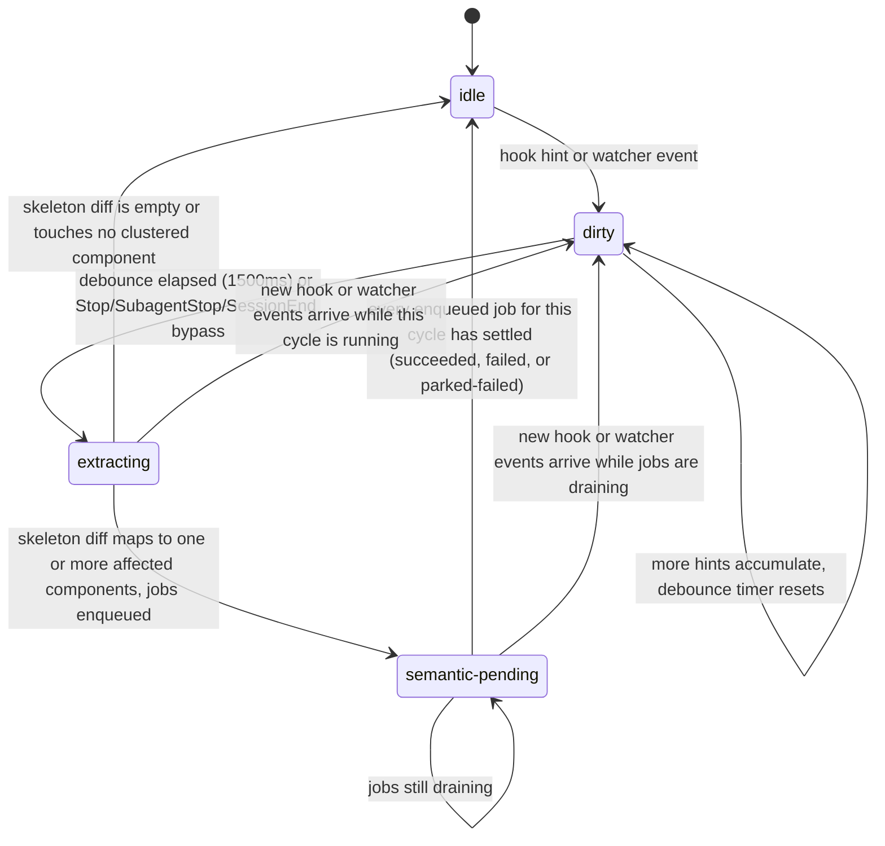

# Hub Sync Pipeline

This document specifies the sync loop mechanics: hook installation, event ingestion, the fallback watcher, the per-project state machine, incremental extraction, persistence/publish, semantic job scheduling, and degradation modes. It is normative and complements `ARCHITECTURE.md` (component responsibilities, timing budget, endpoint/topic contracts) and `DATA_MODEL.md` (the artifacts this pipeline reads and writes).

## 1. Hook installation (`hub track <repo>`, CLI + UI)

Installation is **idempotent** and must never clobber a user's existing hooks. It performs a deep-merge into `<repo>/.claude/settings.json`.

### 1.1 Exact hook commands

Four Claude Code events get a Hub-managed entry. Every managed command carries `|| true` and a `2` second `curl` timeout so a dead or slow Hub can never block or fail an agent's turn, and every command carries a trailing shell comment as its ownership marker (`# hub-managed:v1`) — plain-JSON `settings.json` has no comment syntax, so the marker lives inside the command string itself, where it is inert at execution time (bash treats `#`-to-end-of-line as a comment) and trivially greppable for install/uninstall logic.

| Event | Matcher | Command |
|---|---|---|
| `Stop` | *(none — matcher does not apply to this event)* | `curl -s -m 2 -X POST http://localhost:4820/api/hooks/claude-code -H 'content-type: application/json' --data-binary @- </dev/stdin \|\| true # hub-managed:v1` |
| `SubagentStop` | *(none)* | same command as `Stop` |
| `PostToolUse` | `Edit\|Write\|MultiEdit\|NotebookEdit` | same command |
| `SessionEnd` | *(none)* | same command |

All four events POST to the same endpoint; Hook Ingest (`ARCHITECTURE.md` §3.2) discriminates behavior by the `hook_event_name` field in the JSON body, not by URL. Each managed hook entry also sets the Claude Code hook object's own `timeout` field to `3` seconds — one second above `curl`'s own `-m 2`, so `curl`'s timeout always wins the race and the outer Claude Code timeout is pure defense in depth.

### 1.2 Deep-merge algorithm (install)

Given target event `E` and its canonical command string `C` (from the table above):

1. Read `<repo>/.claude/settings.json`. If it doesn't exist, treat it as `{}` and create `.claude/` if needed.
2. Ensure `settings.hooks` exists as an object.
3. Ensure `settings.hooks[E]` exists as an array.
4. Determine the target matcher for `E` (the string above, or "no matcher" for `Stop`/`SubagentStop`/`SessionEnd`). Find an existing entry in `settings.hooks[E]` whose `matcher` matches the target exactly (both absent/omitted, or both equal to the same string) — this is the *matcher group*. If none exists, append a new `{ matcher?: ..., hooks: [] }` group and use it.
5. Within that group's `hooks` array, search for an entry whose `command` string contains the exact substring `# hub-managed:v1`.
   - **Found, identical command** → no-op (idempotent — this is the common re-run-`hub track` case).
   - **Found, different command** → replace that entry's `command` in place (handles a future marker-version bump or a port change without duplicating entries).
   - **Not found** → append `{ type: "command", command: C, timeout: 3 }` to the group's `hooks` array.
6. Never reorder, edit, or remove any entry in `settings.hooks[E]` (or any other top-level key in `settings.json`) that does not carry the `# hub-managed:v1` marker. User-authored hooks are preserved byte-for-byte in position and content.
7. Write `settings.json` back with 2-space indentation. Pre-existing keys keep their values verbatim (only the hub-managed nodes inside `hooks` are touched); minor incidental key-order diffs from `JSON.stringify` are acceptable here because, unlike `.arch/`, this file is not required to produce a stable byte-identical diff — it is user-owned configuration, not a deterministic artifact.
8. Ensure `.arch/` is not gitignored: run `git check-ignore .arch` (or equivalent); if it reports ignored, append a `!/.arch/` negation line to `.gitignore` with an explanatory comment. Do not otherwise modify `.gitignore`. Hub's own SQLite cache lives outside the repo (a global, cross-project location), so no per-repo cache directory needs to be gitignored by this step.
9. Run the **onboarding scan**: a full extraction (`SkeletonDelta` from a `changedFiles`-omitted call) followed by a full semantic pass (enqueue `cluster`, then `summarize-component` for every resulting component, then `diagram`), synchronously as part of `hub track` completing. This is the only time a full semantic pass runs unprompted by real staleness — it exists purely so a freshly tracked project has a fully green graph on first open rather than a wall of grey badges.

### 1.3 Untrack (`hub untrack <repo>`)

1. Read `settings.json`.
2. In every `settings.hooks[E]` array, remove exactly the entries whose `command` contains `# hub-managed:v1`. Leave every other entry — including other entries in the same matcher group that a user added later — untouched.
3. If removing the marked entry leaves a matcher group's `hooks` array empty **and that group was created by installation** (heuristic: it now has zero entries), remove the empty group object from `settings.hooks[E]` to avoid leaving clutter; if the group still has other, non-Hub entries, leave the group in place.
4. Write `settings.json` back.
5. Stop the FS Watcher and `.git/HEAD`/`refs` watch for this project. Do **not** delete `.arch/` — it remains a valid, committed architecture snapshot even for an untracked repo.

## 2. Hook payload handling (Hook Ingest)

The Claude Code hook JSON is piped to the command's stdin and forwarded verbatim as the HTTP request body. `POST /api/hooks/claude-code` handling, in order:

1. Read the raw body with a hard cap (1MB) — reject oversized bodies with `413` but still respond in-budget; this should never occur in practice for hook payloads.
2. Parse JSON. On parse failure, respond `200 OK` anyway (never surface a client-visible error to the hook — the contract is "the Hub is not allowed to be the reason an agent's turn fails") and best-effort log an `events` row of type matching the failure.
3. Resolve `cwd` (realpath-normalized) against `projects.repo_path`. If no exact match, respond `200 OK` and drop the event (best-effort log `hook.unmapped`); an unmapped `cwd` is not an error condition worth surfacing to the agent.
4. Push a lightweight `{ projectId, hookEventName, sessionId, toolName?, toolInput?, receivedAt }` record onto an in-process event emitter/queue and **return `200 OK` immediately.** All downstream work — forwarding to the Sync Orchestrator, resolving the dirty set, extraction, persistence — happens strictly after the HTTP response has been sent, on a subsequent tick. This ordering, not merely "fast code," is what guarantees the sub-5ms response floor regardless of how much downstream work a given event triggers.
5. The handler must never `await` anything that touches git, the filesystem, SQLite, or the Sync Orchestrator's extraction path before step 4's response is sent.

## 3. Hook health detection and fallback watcher

### 3.1 Fallback watcher (chokidar)

Two watchers per tracked project:

**Content watcher** (primary fallback trigger):
```ts
chokidar.watch(repoRoot, {
  ignored: (path) => isStaticallyIgnored(path) || isGitignored(path),
  ignoreInitial: true,       // hub track's onboarding full-extraction covers the initial state
  persistent: true,
  awaitWriteFinish: { stabilityThreshold: 300, pollInterval: 100 }, // avoid reading partial writes mid-save
});
```
- `isStaticallyIgnored` is a fixed prefix/glob list: `node_modules/`, `.git/` (except the ref watcher below), `.arch/`, `dist/`, `build/`, `coverage/`.
- `isGitignored` batches candidate paths through `git check-ignore --stdin`, cached per path and invalidated whenever `.gitignore` itself changes (which the content watcher, not being ignored itself, naturally observes).
- Emits `change`/`add`/`unlink` events to the Sync Orchestrator, which folds the path into the dirty set exactly like a `PostToolUse` hint (§4).

**Git-ref watcher** (commit/branch-switch detection, since the content watcher excludes `.git/` wholesale):
```ts
chokidar.watch([path.join(repoRoot, ".git/HEAD"), path.join(repoRoot, ".git/refs")], {
  ignoreInitial: true,
  persistent: true,
});
```
- A change to `.git/HEAD` or anything under `.git/refs/**` is forwarded to the Sync Orchestrator as a git-ref event (§5).

### 3.2 Hook health detection

The Sync Orchestrator tracks, per project, `lastHookEventAt` (from `events` rows of type `hook.*`) and `lastWatcherFallbackAt`. Whenever a sync cycle's dirty set was resolved **without** any hook event contributing to it (i.e. the cycle was triggered purely by the content/git-ref watcher) while a PTY session with `command = "claude"` is active for that project (per PTY Manager's session registry), increment a per-project `silentFallbackCount`. After **3** consecutive silent-fallback cycles within the current Hub session, the Sync Status Bar surfaces the persistent banner "hooks not firing for this repo — reinstall?" with a one-click action that re-runs the idempotent installer (§1.2), which self-heals a removed or corrupted managed entry without touching any user hooks. `silentFallbackCount` resets to 0 the moment any hook event is observed for the project. *(The specific threshold of 3 consecutive cycles is a Hub-side judgment call, not specified by product requirements beyond "on repetition" — tune if it proves noisy or slow to trigger in practice.)*

The watcher fallback itself is never gated on this detection — it always runs, unconditionally, for every tracked project. Hook health detection only controls whether/when a user-facing warning appears; it never disables or delays the fallback path.

## 4. Debounce and event coalescing

- `PostToolUse` hook hints and content-watcher events **only** add paths to the project's dirty set and (re)start a **1500ms** debounce timer. They never trigger extraction directly.
- `Stop` (and `SubagentStop`) **bypasses debounce entirely** — it is definitionally the end-of-turn signal, so extraction runs immediately upon receipt, using whatever dirty set has accumulated (hint paths since the last cycle, unioned with `git status --porcelain -z` at the moment of the `Stop` event).
- `SessionEnd` triggers a final flush: if the project is currently `dirty` (debounce pending) or has any unflushed hint paths, run an extraction cycle immediately, identical to a `Stop` bypass, before the session's terminal tab is considered fully idle.
- A **git commit** detected via the git-ref watcher (`.git/HEAD` content change to a value that resolves to a different commit than `skeleton.json.commit`) triggers an extraction cycle (to recompute the now-clean `commit` field and drop any `+dirty` suffix) plus records a **snapshot point** — nothing about the dirty-set algorithm changes; a commit with no working-tree diff often produces an empty `SkeletonDelta` other than the `commit`/`extractedAt` stamp.
- A **branch switch** (git-ref watcher fires on `.git/HEAD` pointing at a different ref, i.e. detected via `git symbolic-ref HEAD` before/after) triggers **bulk-dirty** handling: the dirty set is computed as `git diff --name-only HEAD@{1} HEAD` (every file that differs between the previous and new branch tip) rather than the usual hint-path union, followed by a full staleness recheck across every existing `semantic_artifacts` row for the project (since a branch switch can silently invalidate summaries with zero corresponding hook events).

## 5. Per-project state machine



This machine is enforced by the Sync Orchestrator's per-project async mutex (`ARCHITECTURE.md` §3.4): there is exactly one active occupant of `extracting` per project at any time. The `extracting → dirty` and `semantic_pending → dirty` transitions are how new work is captured without ever starting a second concurrent extraction run — the events accumulate into the dirty set, the state machine returns to `dirty`, and the *next* debounce/`Stop` cycle picks them up. A project can be simultaneously `dirty` (new hints piling up) at the state-machine level while its previous cycle's semantic jobs are still draining in the background; the two are tracked independently (skeleton-cycle state vs. outstanding job count) and the diagram above reflects the skeleton-cycle state machine, which is what the Sync Status Bar's top-line indicator reflects.

## 6. Incremental extraction algorithm

Executed by the Extraction Engine's `ts-js` analyzer when invoked with a non-empty `changedFiles` list.

1. **Resolve the true dirty set.** `git status --porcelain -z` (uncommitted changes) UNION the accumulated hint paths from `PostToolUse`/watcher events since the last successful cycle, filtered to files matching an active analyzer's extensions and passing `manifest.json.scope` include/exclude + gitignore rules.
2. **Re-hash and re-parse only the dirty set.** For each dirty file: recompute its `sha256` hash; if unchanged from the last recorded hash in `skeleton.json.files`, drop it from further processing (a `PostToolUse` hint can fire for a file an agent opened but didn't actually change). For files whose hash did change (or are new), re-run tree-sitter fact extraction (exports, route registrations, test markers) and re-run dependency-cruiser resolution for that file's import statements.
3. **Refresh outbound edges only.** Import edges are stored keyed by their **source** file (`depends-on: from → to`), so fully re-parsing a dirty file's imports completely refreshes every edge for which that file is the `from`. Edges where the dirty file is the `to` (i.e., edges owned by some *other*, unchanged file that happens to import the dirty file) are left untouched — they are correct by construction, since the unchanged file's own import statements didn't change.
4. **Route/test discovery re-runs over dirty files only.** New/changed `api-endpoint` nodes and `tests`/`exposes` edges are derived solely from the dirty set's tree-sitter facts; nothing outside the dirty set is re-scanned for routes or test associations.
5. **Deletions.** A dirty-set file that no longer exists on disk: drop its node and every edge where it is the `from` (outbound). Any edge where it is the `to` (inbound, owned by some other unchanged file) becomes **dangling** — it is not silently dropped. Dangling inbound edges are retained and rendered in the UI as broken-dependency warnings (an intentionally visible signal, most valuable right after an agent refactors and leaves a stale import behind).
6. **Full-extraction fallback triggers.** Any of the following forces a full run (equivalent to calling `extract(root)` with `changedFiles` omitted, i.e. re-parsing every file in scope) instead of the incremental path above:
   - `tsconfig.json` or `package.json` changed (path aliases, dependency set, or module resolution config may have shifted in ways that invalidate any file's previously-resolved imports).
   - The `ts-js` analyzer's own `version` differs from what's recorded in `manifest.json.analyzers`.
   - `manifest.json.schemaVersion` differs from `skeleton.json.schemaVersion`, or either differs from the Hub's currently-running schema version.
   - `manifest.json.scope` (include/exclude globs) changed.
7. **Performance budget.** The incremental path must complete in **under 2 seconds** on a 2,000-file repository for a typical single-turn diff (a handful of changed files). This budget governs implementation choices (e.g. avoiding a full dependency-cruiser graph rebuild when only refreshing a handful of files' outbound edges) but is not a hard runtime assertion — it is the target implementers design against and Vitest golden-timing tests should guard.

## 7. Diff, persist, publish sequence

Executed by the Graph Store immediately after the Extraction Engine returns a `SkeletonDelta`:

1. **Skeleton diff.** Compute: node-ID set difference (added/removed) against the currently-persisted `skeleton.json`; hash comparison for every node whose id is unchanged (did its content change even though the id is stable — e.g. a module's exports list changed); edge set difference (added/removed edges by `(from, to, kind)`).
2. **Persist — single SQLite transaction.** Upsert the `nodes`, `edges` (`raw = 1` rows only — lifted/derived rows are invalidated, not recomputed, inside this transaction), and `files` tables. Recompute `parent_id` for any node whose membership might be affected (in practice, new/removed nodes only — existing nodes' component membership doesn't change from a skeleton-only write). Commit the transaction.
3. **Persist — `.arch/` rewrite.** Rewrite `skeleton.json` (and `manifest.json` if `extractedAt`/analyzer versions changed) with the standard deterministic sorted-key/sorted-array serialization (`DATA_MODEL.md` §6). This write happens after the SQLite transaction commits, so a crash between the two leaves SQLite temporarily ahead of `.arch/` — recoverable, because the next successful cycle's diff is computed against the just-committed SQLite state and will simply re-detect and re-write `.arch/` from it; `.arch/` is not treated as more authoritative than the last successful transaction for recovery purposes, only for git history purposes.
4. **Publish.** WebSocket Gateway broadcasts `graph.skeleton-updated` with the delta (added/removed/changed nodes and edges, plus the new `commit`) to every connected client subscribed to this project.
5. **Staleness recompute.** For every `semantic_artifacts` row whose `component_id`'s current footprint (`DATA_MODEL.md` §10) intersects the set of files touched by this delta, recompute `stale`/`stale_reason` and, if it flipped, include that in the same publish step (or a follow-up `graph.semantics-updated` carrying only the `staleness` field, not new content) so the UI badge updates in the same ~1s window as the skeleton delta — badge appearance must not wait on any job to actually run.

## 8. Semantic job scheduling

### 8.1 Enqueue mapping

After step 5 above, the Sync Orchestrator maps every changed file in the delta to its owning component(s) via `semantics/components.json` membership, then enqueues:
- One `summarize-component` job per **affected** component (a component is affected if any of its member files' hashes changed, or its membership changed).
- One `cluster` job for the whole project, but **only** when structural churn is detected: new files landing in `unassigned` that weren't there before, a component's members dropping to zero (orphaned), or membership churn exceeding the anchoring threshold (§8.3). Ordinary content edits inside an already-clustered file never trigger `cluster`.
- One `diagram` job per component that piggybacks immediately after that component's `summarize-component` job **succeeds** (never enqueued independently in the normal flow — only via the Inspector's explicit "Export Mermaid" action, or this automatic piggyback).
- `describe-tests` jobs are enqueued per component when its member footprint's `tests` edges changed (new/removed test-file associations), independent of whether the component's own source changed.

### 8.2 Priority

Dispatch order (lower priority value dispatches first): `cluster` jobs always precede `summarize-component`/`diagram`/`describe-tests` jobs for the same cycle, since summaries generated against stale membership are wasted work. Among `summarize-component` jobs: a component matching the Graph Canvas's currently-focused node (as tracked via the last `getView` call's `focusNodeId` from any connected client) is dispatched strictly first; ties among the remainder are broken by larger changed-file count first (bigger diffs are assumed higher-value to re-summarize promptly). `diagram` and `describe-tests` jobs for a component are dispatched immediately after that component's own `summarize-component` job completes, ahead of unrelated components' jobs still waiting. *(The exact numeric priority formula is an implementation detail left to the coordinator/implementer; the ordering rules above are the contract Vitest scheduling tests should assert against, not a specific weighting function.)*

### 8.3 Dedup

Jobs are deduplicated by `(type, targetId)` among rows with `status = 'queued'`: enqueuing a job whose `(type, targetId)` already has a `queued` (not yet `running`) row supersedes it — the existing row's `priority` is raised to the max of the two and no new row is inserted. A job already `running` is never superseded; a new request for the same `(type, targetId)` while one is `running` is queued as a fresh row (it will pick up whatever state exists once dispatched).

### 8.4 Retry and backoff

On failure (LLM error, schema-validation failure of the output, timeout), a job is retried up to **3** times with exponential backoff: retry 1 after 10s, retry 2 after 40s, retry 3 after 160s (factor 4). After the 3rd retry also fails, the job's `status` becomes `parked-failed` and it stops retrying automatically. `parked-failed` jobs surface a retry badge in the UI (on the affected component, and aggregated in the Sync Status Bar); a manual retry action resets `attempt` to 0 and re-queues it. *(The specific backoff constants are a Hub-side judgment call — the brief specifies "×3 exponential backoff" without exact intervals.)*

### 8.5 Anchored clustering and churn rejection

Every `cluster` job run is **anchored**: the prompt is given the previous `components.json` in full and instructed to preserve every existing component's `id` and `members` for files that haven't structurally changed, and to only (a) assign currently-`unassigned` files to an existing or new component, and (b) reassign orphaned files (whose previous component no longer exists or lost all other members). It is never instructed to freely re-cluster the whole project from scratch.

Any proposed **membership move** (a file leaving component A for component B, where both already existed and both still have other members) that the model proposes above a confidence bar is **never auto-applied** — it is surfaced as a suggestion card in the UI (component id, moved file(s), model's stated rationale) requiring explicit user acceptance before `components.json` is rewritten to reflect it.

If a `cluster` run's proposed diff — computed as `|changed members| / |total members before the run|` — exceeds **30%**, the entire run is **auto-rejected**: `components.json` is left untouched, the job is marked `failed` with `error = "churn exceeds 30% threshold"`, and no suggestion cards are generated from it. This is a hard product-trust guardrail (`SYNC_PIPELINE.md` risk #1 in the design brief): components must never appear to the user to have been reshuffled wholesale by a routine sync.

### 8.6 `describe-tests`

Produces/updates `testCoverageNotes` on the affected component's `semantics/<componentId>.json` by reasoning over the component's `tests` edges (which test-files test which of its member modules) and, post-MVP, ingested coverage data. MVP scope: text notes only, no coverage-percentage computation.

## 9. Degradation modes

Degradation is modeled as **first-class, persistently rendered state**, not as transient error toasts — the Sync Status Bar (`ARCHITECTURE.md` §4.4) always reflects the true condition of the pipeline.

| Condition | Detection | Behavior |
|---|---|---|
| **LLM unavailable** (no API key, network down, Agent SDK and `claude -p` fallback both failing) | A dispatched job's SDK call and its `claude -p` fallback both fail with a connectivity/auth-class error (distinct from a content/schema-validation failure, which is a normal per-job retry case, §8.4) | Affected jobs stay `queued` (not force-failed for connectivity reasons alone — the queue holds rather than burning retry budget on an environment problem). The skeleton half of the loop is entirely unaffected and keeps updating on every turn. Every component pending summarization shows its normal amber/grey badge. Sync Status Bar shows a persistent banner: `"Semantics: LLM unavailable — N jobs queued."` This is documented as a normal, expected operating mode (e.g. offline development), not an error state. |
| **Hub down** (server process not running, or unreachable) while Claude Code continues to be used | `curl ... || true` in every hook fails silently and fast (connection refused, well under the 2s timeout); the agent's turn is completely unaffected. | On the next Hub startup, for every tracked project the Sync Orchestrator runs a **catch-up reconciliation pass**: compare the persisted `skeleton.json.commit`/dirty state against current `git status --porcelain` and `git rev-parse HEAD`; if they differ at all, treat this exactly as an immediate `Stop`-bypass extraction cycle (§4) rather than waiting for the next real hook. This guarantees a server restart never leaves a silently stale graph. |
| **Extraction failure** (analyzer throws — e.g. a malformed/unparseable file, an internal bug) | The Extraction Engine's `extract()` call throws or returns a result that fails internal validation | The Sync Orchestrator must not write a partial/corrupt `SkeletonDelta` — the last known-good `skeleton.json`/SQLite state is left completely untouched. The project's global status flips to a persistent Sync Status Bar banner: `"Skeleton stale since <time>."` No semantic jobs are enqueued from this cycle (there is no valid delta to map to components). The failure is logged to `events` (`extraction.failed`) with the error detail available via a "why?" affordance on the banner. The next successful trigger (another hook/watcher event) attempts extraction again automatically; the banner does not require a manual dismiss, it simply clears the moment a cycle succeeds. |

Across all three modes, the invariant from `ARCHITECTURE.md` §5 holds: the skeleton layer's correctness is never allowed to depend on LLM availability, and the agent's Claude Code turn is never allowed to depend on Hub availability. Degradation is Hub-side only, and it is always visible, never silent.
