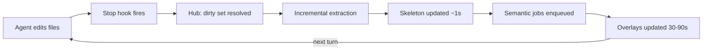

# VISION.md — The Hub

## The problem

Agent-driven development leaves no trustworthy, current view of a system's actual
architecture. A developer who plans in voice, fans out Claude Code agents, and does
not read the resulting code has no reliable answer to "what does this system actually
look like right now?" The artifacts that exist — plan `.md` files written before the
agents ran, README diagrams from three refactors ago — describe intent, not the
codebase as it exists after the agents finished. These files pile up, go stale
silently, and are indistinguishable at a glance from something still true. The only
ground truth is the code itself, and the developer this product is for does not read
code. Without a mechanism that re-derives its view of the system every time the code
changes, any architecture documentation degrades from asset to liability the moment
it stops being maintained by hand — which, in a fully agent-driven workflow, is
immediately.

## Product thesis

The Hub is an architecture-first daily driver, not an IDE with an added diagram tab.
The knowledge graph — system → components → APIs/pipelines/test suites → modules — is
the **primary artifact** the developer works from: it is what they open, read, and
navigate to understand and steer their project. Code is the escape hatch, reachable
one level down through "open externally," never edited in the Hub. This inverts the
usual relationship between code and documentation: instead of a graph that describes
the code and drifts from it, the graph **is** the interface, kept honest by
construction rather than by discipline.

## The sync-loop promise

Every time an agent's turn ends, a hook fires, and the Hub re-derives the parts of
the graph that could have changed — deterministically for structure (the skeleton),
asynchronously via LLM for meaning (the semantic layer). The developer never has to
remember to update anything, run a doc generator, or wonder whether what they're
looking at reflects the last five minutes of agent work.

**Drift is product death.** The entire value proposition is "trust this view instead
of reading the code." A single confirmed instance of the graph showing something that
is no longer true, without saying so, destroys that trust permanently — the developer
has no independent way to catch the lie, since not reading code is the premise. This
is why staleness detection, not graph prettiness, is the product's core engineering
problem, and why every invariant in `../CLAUDE.md` about the two-layer principle and
pure-function staleness exists.

## UX principles

- **Honesty over completeness.** A node with no LLM summary yet, rendered plainly
  with a grey "never summarized" badge, is correct. A node with a summary that might
  be stale, rendered without a badge, is a lie. Every piece of derived information
  carries a visible confidence state; nothing is presented as more current than it
  is.
- **Skeleton truth in about a second.** Structural facts — what modules exist, what
  imports what, what routes exist — are deterministic and cheap. They update in
  roughly a second after a turn ends, before any LLM has run. The developer is never
  waiting on a model call to see that something changed.
- **Semantic lag is a visible state, not an error.** LLM-derived summaries,
  clusters, and diagrams take 30–90 seconds and sometimes fail or queue behind other
  work. This is rendered as an amber "stale, N files changed since commit X" badge —
  a normal, expected, first-class product state — never as a spinner standing in for
  a hidden failure, and never as a blank panel.
- **Drill down one level at a time.** The canvas shows the children of the focused
  node and nothing else, with breadcrumb navigation back up. The graph is never
  rendered whole; scale is managed by hiding, not by shrinking.
- **Never build an editor.** Code is reached by delegating to `open -a`, `$EDITOR`,
  or `code --goto`, and nothing more. The Hub has no code-editing surface now or in
  any planned future version.

## Non-goals

- Not an IDE fork. There is no file tree as the primary navigation surface, no code
  editor, no language server integration for editing.
- Not a git replacement. Version control stays plain git; the Hub reads commit state
  to timestamp its own artifacts and does not manage branches, merges, or history.
- No code editing anywhere in the product, MVP or beyond.
- No multi-user or cloud sync in the MVP. One local Node server, one browser tab, one
  developer, projects on local disk.

## MVP definition

The MVP is the full loop for a single project: embedded terminal, drillable graph,
and end-to-end sync driven by Claude Code hooks — proving the sync-loop promise holds
for one real project before any breadth feature is considered. Multi-project
dashboards, GitHub/GitLab overlays, and a dedicated test-suite explorer are
deliberately excluded from the MVP even though they are straightforward extensions of
data already being collected.

## Post-MVP

Post-MVP work extends breadth and integrations without touching the two-layer
architecture or the sync loop: a multi-project dashboard, GitHub/GitLab overlay data
(PR/CI state pinned to graph nodes), an architecture-diff view between commits, a
test-suite explorer, the editor/terminal escape hatch refinements, an L3 symbol level
with `calls` edges, and voice dictation into the terminal panel. See
`docs/ROADMAP.md` for the full, ordered list and rationale for each.
